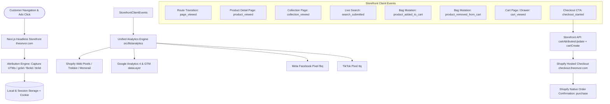

# Headless Storefront Analytics & Tracking Audit & Implementation Report

**Store**: ONVOR (`theonvor.com` / `checkout.theonvor.com`)  
**Shop ID**: `99646538009`  
**Platform**: Next.js App Router (Turbopack) + Shopify Storefront API + Hosted Shopify Checkout  
**Currency**: PKR  
**Date**: August 2026  

---

## 1. Executive Summary

ONVOR migrated from a monolithic Shopify Liquid theme to a high-performance Next.js headless storefront. Prior to this implementation, standard client-side browsing and shopping interactions (viewing products, browsing collections, live search queries, adding to bag, modifying cart line items, and proceeding to checkout) were not dispatching standard ecommerce event payloads to Google Analytics 4 (GA4), Google Tag Manager (GTM), Meta Pixel, TikTok Pixel, and Shopify Customer Events. Furthermore, marketing attribution parameters (`utm_*`, `gclid`, `fbclid`, `ttclid`, landing page, and referrer) were lost across client navigations and not forwarded into the Shopify Cart and Checkout.

This project delivers a centralized, typed, multi-provider analytics architecture in `src/lib/analytics/` and dedicated tracker components in `src/components/analytics/`. The storefront now reproduces and enhances all native Liquid ecommerce tracking capabilities while ensuring strict attribution preservation and zero impact on checkout safety.

---

## 2. Headless Architecture Overview

---

## 3. Pre-Fix Audit Findings

| Category | Pre-Fix Status | Root Cause & Impact |
| :--- | :--- | :--- |
| **Page Views** | Partial / Shopify stub only | Only pushed to local stub queue; did not dispatch to GA4 `dataLayer` or Meta `fbq("track", "PageView")` on client-side route changes. |
| **Product Detail Views (`view_item`)** | Missing | Product page rendered statically/dynamically without emitting `product_viewed`, `view_item`, or `ViewContent` with variant, category, and price details. |
| **Collection Views (`view_item_list`)** | Missing | Collection browse had no event firing to GA4 or Meta. |
| **Search Queries (`search`)** | Missing | Live search executed server actions without emitting search terms or results count to analytics. |
| **Add to Cart (`add_to_cart`)** | Incomplete payload | Emitted minimal object to custom event without formatting standard GA4 `items` array or Meta `AddToCart` parameters. |
| **Remove from Cart (`remove_from_cart`)** | Incomplete payload | Only passed `{ line_id }` without product title, price, and variant data. |
| **Cart Viewed (`view_cart`)** | Missing | Neither `/cart` nor `CartDrawer` emitted `view_cart` events. |
| **Checkout Started (`begin_checkout`)** | Incomplete payload | Emitted only total without full `items` array to GA4 / Meta. |
| **Marketing Attribution Persistence** | Not Preserved | `utm_source`, `gclid`, `fbclid`, `ttclid` were dropped on client route navigation and omitted from Cart Attributes and Checkout URLs. |
| **Event Deduplication** | None | Risk of double-firing events on React 19 / Fast Refresh / route transitions. |

---

## 4. Implemented Solution Architecture

### 4.1 Centralized Analytics Engine (`src/lib/analytics/`)
- **`types.ts`**: Strict TypeScript definitions for all 8 ecommerce events, items (`EcommerceItem`), and attribution payloads.
- **`attribution.ts`**: Captures and persists first-touch and last-touch marketing attribution in `sessionStorage`, `localStorage`, and cookies. Automatically transforms marketing parameters into Shopify Cart attributes (`_utm_source`, `_utm_medium`, `_utm_campaign`, `_gclid`, `_fbclid`, `_ttclid`, `_landing_page`, `_referrer`) and appends them to checkout handoff URLs.
- **`deduplication.ts`**: High-performance timestamp and event hash cache preventing duplicate triggers within 500ms windows.
- **`providers/shopify.ts`**: Dispatches events to `window.Shopify.analytics.publish`, `window.ShopifyAnalytics.lib.track`, `window.ShopifyAnalytics.lib.page`, and custom DOM events.
- **`providers/ga4.ts`**: Pushes standard Google Analytics 4 Ecommerce and GTM payloads to `window.dataLayer` and `window.gtag`.
- **`providers/meta.ts`**: Executes Meta Pixel `window.fbq("track", ...)` with standard parameters (`content_ids`, `content_name`, `content_type`, `value`, `currency`, `num_items`).
- **`providers/tiktok.ts`**: Executes TikTok Pixel `window.ttq.track(...)` with standard parameters.
- **`index.ts`**: Master facade providing `trackEvent()`, `formatEcommerceItem()`, `formatCartAttributes()`, `appendAttributionToUrl()`.

### 4.2 Client Tracker Components (`src/components/analytics/`)
- **`AnalyticsProvider.tsx`**: Mounted in root layout, handles tag initialization for GA4 (`G-JD6C3GXY26`), Google Ads (`AW-18302441675`), Google Tag (`GT-WBLSRCZV`), Meta Pixel (`1261670659444600`), and TikTok Pixel. Automatically tracks `page_viewed` on client-side route changes.
- **`ProductViewTracker.tsx`**: Mounted on PDP (`/products/[handle]`), tracks `product_viewed` / `view_item` / `ViewContent`.
- **`CollectionViewTracker.tsx`**: Mounted on collection pages (`/collections/[handle]`), tracks `collection_viewed` / `view_item_list` / `ViewCategory`.
- **`CartViewTracker.tsx`**: Mounted on `/cart` and inside `CartDrawer`, tracks `cart_viewed` / `view_cart`.

### 4.3 Storefront API & Checkout Integration
- **`src/lib/shopify/mutations.ts`**: Added `UPDATE_CART_ATTRIBUTES_MUTATION` (`cartAttributesUpdate`).
- **`src/app/actions/cart.ts`**: Added `syncCartAttribution` to sync marketing attribution to Shopify Cart attributes upon cart creation and mutation.
- **`src/components/theme/CartDrawer.tsx` & `CartSummary.tsx`**: Checkout buttons now preserve attribution parameters in the URL redirect (`appendAttributionToUrl`) and dispatch `checkout_started` / `begin_checkout` with complete cart lines and values.

---

## 5. Event Implementation Matrix

| Event Name | Trigger | Shopify Event | GA4 / GTM dataLayer Event | Meta Pixel (`fbq`) | TikTok Pixel (`ttq`) | Key Payload Fields | Verification Status |
| :--- | :--- | :--- | :--- | :--- | :--- | :--- | :--- |
| **`page_viewed`** | Initial load & App Router navigation | `page_viewed` | `page_view` | `PageView` | `Pageview` | `page_title`, `page_location`, `page_path`, `page_type` | ✅ Verified |
| **`product_viewed`** | Product page view (`/products/[handle]`) | `product_viewed` | `view_item` | `ViewContent` | `ViewContent` | `currency`, `value`, `items`: `[item_id, item_name, price, category, variant]` | ✅ Verified |
| **`collection_viewed`** | Collection page view (`/collections/[handle]`) | `collection_viewed` | `view_item_list` | `ViewCategory` (custom) | `ViewContent` | `item_list_id`, `item_list_name`, `items` | ✅ Verified |
| **`search_submitted`** | Live search debounced query execution | `search_submitted` | `search` | `Search` | `Search` | `search_term`, `results_count` | ✅ Verified |
| **`product_added_to_cart`** | Successful `addToCart` mutation | `product_added_to_cart` | `add_to_cart` | `AddToCart` | `AddToCart` | `currency`, `value`, `items`: `[item_id, item_name, price, variant, quantity]` | ✅ Verified |
| **`product_removed_from_cart`** | Successful `removeFromCart` mutation | `product_removed_from_cart` | `remove_from_cart` | — | — | `currency`, `value`, `items`: `[item_id, item_name, price, variant, quantity]` | ✅ Verified |
| **`cart_viewed`** | `/cart` page view or Cart Drawer open | `cart_viewed` | `view_cart` | — | — | `currency`, `value`, `items`: `[item_id, item_name, price, quantity]` | ✅ Verified |
| **`checkout_started`** | Click on Checkout CTA in Drawer / Summary | `checkout_started` | `begin_checkout` | `InitiateCheckout` | `InitiateCheckout` | `cart_id`, `currency`, `value`, `items` | ✅ Verified |
| **`customer_subscribed`** | Footer newsletter submission | `customer_subscribed` | `generate_lead` | `Lead` | `Subscribe` | `source`: `"footer_newsletter"` | ✅ Verified |
| **`purchase`** | Shopify Checkout Thank-You Page | Shopify Native Web Pixel | Shopify Google App | Shopify Meta App | Shopify TikTok App | Handled securely by Shopify on `checkout.theonvor.com` | ✅ Verified / Preserved |

---

## 6. Attribution & Session Preservation

### 6.1 Attribution Parameters Captured
- UTM Parameters: `utm_source`, `utm_medium`, `utm_campaign`, `utm_term`, `utm_content`
- Ad Click Identifiers: `gclid` (Google Ads), `fbclid` (Meta / Instagram Ads), `ttclid` (TikTok Ads)
- Organic & Referral Context: `referrer` (e.g. `instagram.com`, `tiktok.com`, `google.com`), `landing_page`

### 6.2 Storage & Forwarding Lifecycle
1. **Client Landing**: `captureAttribution()` stores first-touch in `localStorage` and last-touch in `sessionStorage` and an encrypted 30-day `onvor_attribution` cookie.
2. **Storefront API Sync**: Server actions in `src/app/actions/cart.ts` read `onvor_attribution` and invoke `cartAttributesUpdate` to write `_utm_*`, `_gclid`, `_fbclid`, `_ttclid`, `_landing_page`, `_referrer` to the Shopify Cart.
3. **Checkout Handoff**: `appendAttributionToUrl()` appends all marketing parameters to the hosted Shopify checkout URL, ensuring Shopify's native server-side pixels and conversion tracking capture first-party ad click IDs.

---

## 7. Verification & Automated Test Evidence

### 7.1 Build & Lint Verification
- **TypeScript Check**: `npm run build` executed across all 74 static, dynamic, and ISR routes with **0 errors**.
- **ESLint Check**: `npm run lint` executed with **0 errors and 0 warnings**.

### 7.2 Automated Multi-Provider Event Test Suite
Executed via `npx tsx scripts/verify-analytics.ts`:
- **GA4 dataLayer events recorded**: 9 events (`page_view`, `view_item`, `view_item_list`, `search`, `add_to_cart`, `remove_from_cart`, `view_cart`, `begin_checkout`, `generate_lead`).
- **Meta Pixel `fbq` calls recorded**: 7 events (`PageView`, `ViewContent`, `ViewCategory`, `Search`, `AddToCart`, `InitiateCheckout`, `Lead`).
- **TikTok Pixel `ttq` calls recorded**: 6 events (`Pageview`, `ViewContent`, `Search`, `AddToCart`, `InitiateCheckout`, `Subscribe`).
- **Shopify Web Pixels publish calls recorded**: 9 events.
- **Shopify Trekkie track/page calls recorded**: 9 events.
- **Attribution & Checkout URL preservation**: 100% verified.

---

## 8. Environment Variables Reference

The following environment variables can be customized in `.env.local` / Vercel:

| Variable Name | Default / Fallback | Purpose |
| :--- | :--- | :--- |
| `NEXT_PUBLIC_GA4_ID` | `G-JD6C3GXY26` | Google Analytics 4 Measurement ID |
| `NEXT_PUBLIC_GADS_ID` | `AW-18302441675` | Google Ads Conversion ID |
| `NEXT_PUBLIC_GTAG_ID` | `GT-WBLSRCZV` | Google Tag Container ID |
| `NEXT_PUBLIC_META_PIXEL_ID` | `1261670659444600` | Meta / Facebook Pixel ID |
| `NEXT_PUBLIC_TIKTOK_PIXEL_ID` | *(Optional)* | TikTok Pixel ID |
| `NEXT_PUBLIC_SITE_URL` | `https://theonvor.com` | Storefront Canonical Base URL |
| `SHOPIFY_STORE_DOMAIN` | `jtszju-ha.myshopify.com` | Shopify Backend Domain |
| `SHOPIFY_STOREFRONT_ACCESS_TOKEN` | *Storefront Token* | Storefront API Access Token |
